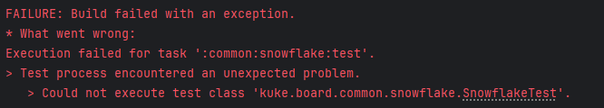
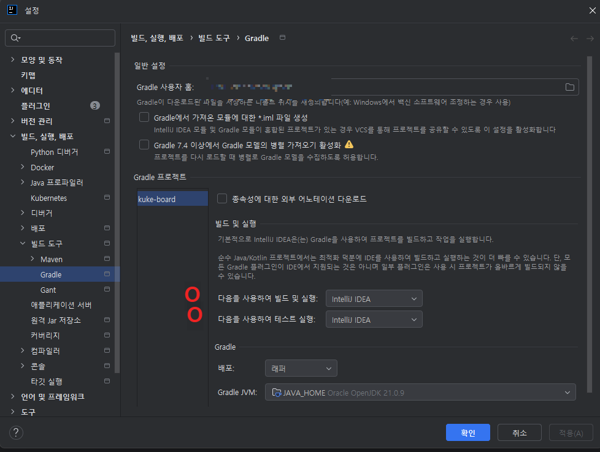
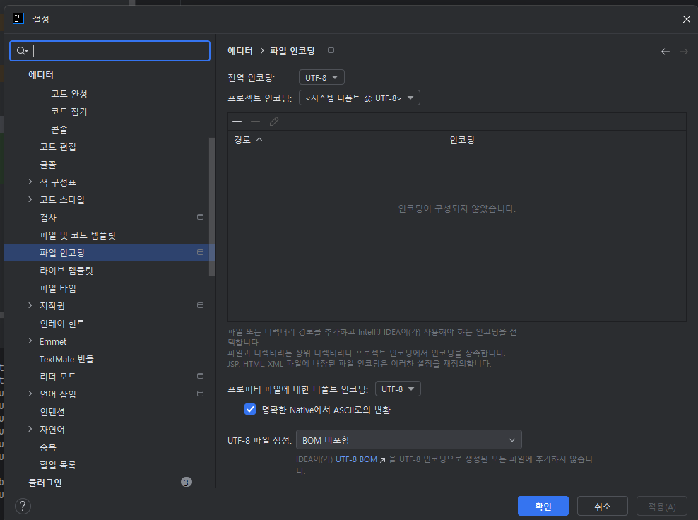

# java.lang.ClassNotFoundException 해결하기
MSA 구조 프로젝트에서 모듈 테스트를 진행하던 도중 Build failed가 발생했다.

그런데 문제는… 명확한 오류 메시지가 보이지 않았다는 점이었다.

그래서 원인을 확인하기 위해 cmd 창에서 다음 명령어를 실행했다.
```bash
gradlew :common:snowflake:test --stacktrace
```

## 발생한 오류
stacktrace를 확인해보니 다음과 같은 오류를 발견할 수 있었다.
```
Caused by: org.gradle.api.internal.tasks.testing.TestWorkerFailureException: 
Test process encountered an unexpected problem.

Caused by: org.gradle.api.internal.tasks.testing.TestSuiteExecutionException: 
Could not execute test class 'kuke.board.common.snowflake.SnowflakeTest'.

Caused by: java.lang.ClassNotFoundException: 
kuke.board.common.snowflake.SnowflakeTest

```
요약하자면 Gradle이 SnowflakeTest 클래스를 찾지 못해 ClassNotFoundException이 발생한 상황이었다.

## 그런데 이상한 점 🤔

테스트 코드의 위치 자체는 전혀 문제가 없었다. 패키지 경로도 올바르고, 파일도 정상적으로 존재했다.
그럼에도 Gradle은 해당 클래스를 찾지 못하고 있었다.

## 원인: 프로젝트 경로에 한글이 포함된 경우
구글링을 조금 해보니, 프로젝트가 위치한 경로에 한글이 포함되어 있을 경우
Gradle이나 테스트 실행 시 인코딩 문제로 ClassNotFoundException이 발생할 수 있다는 글들을 발견했다.

실제로 내 프로젝트 경로는 다음과 같았다.

```
C:\Users\[user명]\Desktop\[한글_디렉토리명]\project
```

## 시도해본 해결 방법들
### 1️⃣ VM 옵션 인코딩 설정
루트 경로에 gradle.properties 파일을 생성하고 다음 내용을 추가했다.
```
Dfile.encoding=UTF-8
Dconsole.encoding=UTF-8
```

### 2️⃣ Gradle 실행 환경 변경
IntelliJ에서 다음 설정을 변경했다.
```
Settings > Build Tools > Gradle
```

* Build and run using → IntelliJ IDEA
* Run tests using → IntelliJ IDEA

### 3️⃣ 파일 인코딩 설정
```
Settings > Editor > File Encodings
```

* Global Encoding → UTF-8
* Project Encoding → UTF-8
* Default encoding for properties files → UTF-8

보통은 위 3가지 설정을 모두 적용하면 테스트가 정상 실행된다고 하는데,
나는 여전히 같은 오류가 발생했다.

## 최종 해결 방법
결국 프로젝트 디렉터리 자체를 모두 영어 경로로 변경했다.
```
C:\Users\[user명]\Desktop\project
```

그 후 다시 테스트를 실행해보니… <br>
👉 문제없이 테스트가 성공했다.