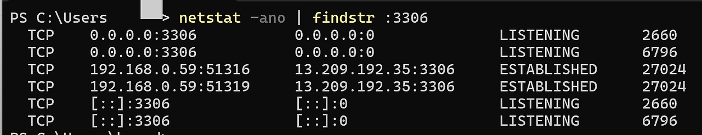
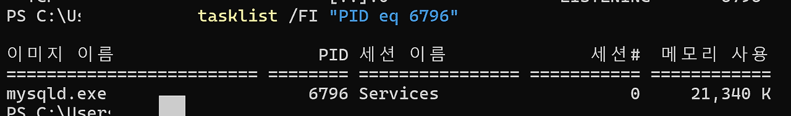
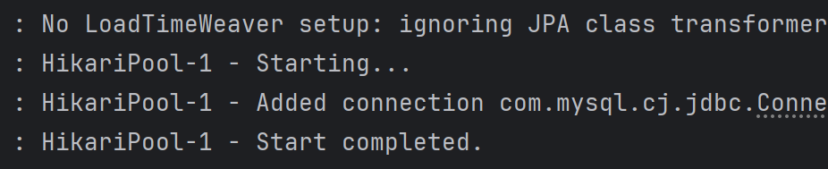

# Docker MySQL + Spring Boot 연결 오류 해결기 (feat. 포트 충돌)
프로젝트 개발 과정에서 Docker로 MySQL 컨테이너를 띄우고 SpringBoot와 연동하는 과정에서 예상치 못한 오류를 만났다. SpringBoot를 실행하자마자 다음과 같은 Hibernate 예외가 발생했다.

```
java.lang.NullPointerException: Cannot invoke "SqlExceptionHelper.convert(...)"
because the return value of "JdbcIsolationDelegate.sqlExceptionHelper()" is null
```

Hibernate 내부에서 NPE가 뿜어지다 보니 문제 파악이 쉽지 않았지만, 결론부터 말하면 DB 연결 자체가 실패하면서 Hibernate가 JDBC 메타데이터를 읽지 못해 생긴 현상이었다.


## 📍문제 상황
나는 Docker에서 MySQL 컨테이너를 다음과 같이 실행한 상태였다.

```
docker run --name kuke-board-mysql-e MYSQL_ROOT_PASSWORD={pw} -d -p 3306:3306 mysql:8.0.38
```
컨테이너 내부에는 article이라는 데이터베이스도 생성해 두었다.
Spring Boot의 application.yml 설정도 정상적으로 작성한 상태였다.


따라서 내가 작성한 application.yml 파일은 다음과 같았다.

```
spring:
datasource:
driver-class-name: com.mysql.cj.jdbc.Driver
url: jdbc:mysql://127.0.0.1:3306/article
username:
password:
jpa:
database-platform: org.hibernate.dialect.MySQL8Dialect
```
설정상 문제는 없어 보였기 때문에, MySQL 컨테이너 쪽에서 문제가 발생했다고 판단했다.


## 📍MySQL 컨테이너 로그 확인
컨테이너를 중지하고 로그를 보기 위해 다음 명령을 실행했다.

```
docker start -a kuke-board-mysql
```


출력된 로그는 아래와 같았다.

```
mysqld: ready for connections. Version: '8.0.38'
socket: '/var/run/mysqld/mysqld.sock' port: 3306
```
경고 메시지 몇 개가 있지만 모두 MySQL 컨테이너에서 흔히 볼 수 있는 정상적인 내용이었다.
결론적으로 컨테이너는 정상 동작 중이었다.


## 📍근본 원인 파악: 포트 충돌
컨테이너는 정상인데 Spring Boot에서는 DB 연결이 실패한다?
이 상황에서 떠올릴 수 있는 가장 큰 원인은 바로 포트 충돌이다.

그래서 컨테이너를 종료한 뒤 3306 포트를 점유하고 있는 프로세스를 확인했다.





결과는 의외로 간단했다.

로컬에 설치되어 있던 Windows MySQL 서비스가 이미 3306포트를 점유하고 있었던 것이다. (나같은 경우는 mysqld.exe라고 떠있지만 실제로는 MariaDB였다)

Docker MySQL 컨테이너 또한 동일한 포트를 사용하려고 했기 때문에 충돌이 발생했고, 결과적으로 Spring Boot가 Docker MySQL에 연결하지 못했다.


## 📍해결 및 결론
문제의 핵심은 Spring Boot 설정도, Docker 설정도 아닌 단순한 포트 충돌이었다.
로컬 MariaDB 서비스가 3306을 선점하고 있었고, Docker MySQL 컨테이너는 해당 포트를 제대로 바인딩하지 못해 Spring Boot 연결이 실패한 것이다.

Windows MariaDB 서비스를 중지한 뒤 Docker 컨테이너를 다시 실행하니 문제는 바로 해결되었다.

```
net stop MariaDB
docker start kuke-board-mysql
```
<br>



<small>정상적으로 실행된 모습</small>


<br>

🖐️추후에 로컬 MariaDB을 다시 시작하기 위해선 다음과 같이 해주면 된다!

```
net start MariaDB
```

