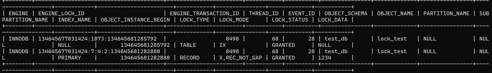
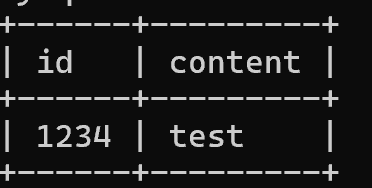
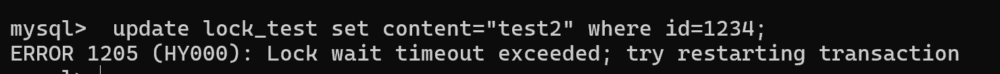
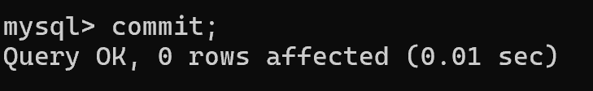
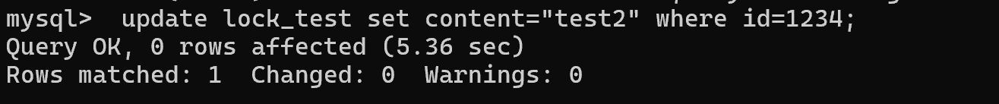
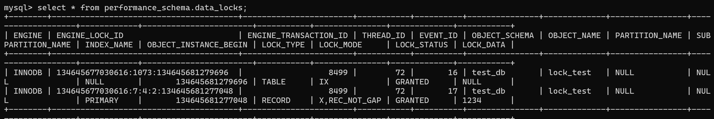
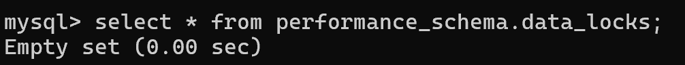

# Record Lock(행 단위 잠금)과 분산 트랜잭션
## 📍학습 배경
좋아요 수 기능을 구현하려고 하는데, 구현할 수 있는 방법은 2가지가 있었다. 
<br>
1. 조회 시점에 좋아요 수를 실시간 조회한다.
2. 좋아요 테이블의 게시글 별 데이터 개수를 미리 하나의 데이터로 비정규화 해둔다.
<br>

좋아요 수는 1. 쓰기 트레픽이 크지 않고, 2. 데이터 일관성이 중요하기 때문에 2번 방법을 사용하고, 좋아요 데이터의 생성/삭제와 좋아요 수 갱신을 하나의 트랜잭션으로 잡기로 했다. 
<br><br>

그렇다면 여기서도 두 가지 선택지가 존재한다.
<br>

1. 좋아요 수 칼럼을 게시글 테이블에 추가한다.
2. 좋아요 수를 별도의 테이블로 관리한다. 

<br> 
위 두 방법 중 어느 것이 효율적일지 판단하기 위해서는 Record Lock과 분산 트랜잭션에 대한 이해가 필요했다. 


<br><br><br>
## 📍Record Lock(= Row Lock, 행 단위 잠금)
레코드(행)에 락을 것이다. 동일한 레코드를 동시에 조회/수정할 때 데이터의 무결성을 보장하고 경쟁 상태를 방지한다. 

<br><br>

### Record Lock 테스트
1. 테스트 용 db, table 생성 
```mysql
create database test_db;
use test_db;
create table lock_test (
    id bigint not null primary key,
    content varchar(100) not null
);
```
<br>

2. 테스트 데이터 1개 삽입
```mysql
insert into lock_test values(1234, "test");
```
<br>

3. 트랜잭션 시작 후 테스트 데이터 수정
```mysql
start transaction;
update lock_test set content="test2" where id=1234;
```
<br><br>
여기까지 수행했을 때 현재 락이 어떻게 잡혀있는지 확인해보자.
```mysql
select * from performance_schema.data_locks;
```
<br>


확인해보면 LOCK_TYPE=RECORD, LOCK_MODE=X, LOCK_DATA=1234인 것을 확인할 수 있다. <br><br>
즉, id가 1234인 행에 레코드 락이 걸려있고, 그중 X 모드 락(쓰기 락)이 걸려있다는 것이다. 


<br><br>

4. 새로운 터미널 오픈 후 데이터 조회
```mysql
select * from lock_test where id=1234;
```

편의를 위해 이전 터미널을 터미널1, 후에 오픈한 터미널을 터미널2로 칭하겠다. 터미널1에서 오픈한 트랜잭션이 아직 커밋되지 않았기 때문에 데이터는 여전히 test(이전데이터)이다. 

5. 터미널2에서 동일 레코드 수정 시도
```mysql
start transaction;
update lock_test set content="test2" where id=1234;
```

수정에 실패했음을 알 수 있다. 이유는 락 획득 실패로 인한 타임아웃이다. 터미널1에서 실행한 트랜잭션이 아직 커밋되지 않았기 때문에 해당 레코드에 대해서 락을 가지고 있고, 따라서 터미널2에서 락을 잡기를 시도했지만 실패했다. 

6. 터미널1의 트랜잭션 커밋 후 터미널2에서 레코드 수정
다시 터미널2에서 레코드 수정을 시도하고, 바로 직후 터미널1의 트랜잭션을 커밋(종료)해보자.

<small>터미널1에서 트랜잭션 종료</small>

<small>터미널2에서 업데이트 성공</small>

<br> 


락을 다시 확인해보면 `ENGINE_TRANSACTION_ID`가 이전에는 8498이지만 현재는 8499인 것을 보아 기존 락이 해제되고 새로운 락이 걸린 것을 알 수 있다. 
<br><br>
이를 통해 터미널1에서 트랜잭션이 커밋되면서 가지고 있던 락이 해제되었고 이후 즉시 터미널2에서 행 업데이트를 수행하면서 락을 건 것임을 유추할 수 있다. 
<br>

7. 터미널2의 트랜잭션 커밋
그럼 이제 터미널2의 트랜잭션도 커밋(종료)해준 후 다시 락 목록을 확인하면 

비어있음을 알 수 있다. 

<br><br><br>

### 좋아요 수 칼럼을 게시글 테이블에 추가하는 방법의 단점?
결론부터 말하면 **게시글과 좋아요 수의 라이프사이클이 다르**기 때문에 해당 방법은 적절하지 않다.
<br><br>
게시글은 **작성자**만 쓰기 작업을 수행하기 때문에 트래픽이 상대적으로 적지만 <br>
좋아요 수는 **조회자** 모두가 쓰기 작업을 수행하기 때문에 트래픽이 상대적으로 많다. 
<br><br>
따라서 게시글과 좋아요 수는 서로 독립적으로 수행되어야 한다. <br>
이와 동시에 따라서 **테이블 비정규화**가 필요하다고 판단할 수 있다. 

<br><br><br>

### 그렇다면 좋아요 수 테이블은 어디에 두는게 맞을까?
보통 트랜잭션은 단일 데이터베이스 내에서 안정적이고 빠르게 지원한다. 
<br><br>
현재는 게시글 테이블은 게시글 데이터베이스에서 관리하고 있다. 만약 좋아요 수 테이블을 게시글 데이터베이스에서 관리한다면, 좋아요 테이블은 다른 데이터베이스(좋아요 db)에서 관리되고 있기 때문에 분산 환경에서의 트랜잭션으로 간주된다(좋아요 생성/삭제와 좋아요 수 갱신을 하나의 트랜잭션으로 간주할 것이므로).
<br><br> 
따라서 좋아요 수 테이블은 좋아요 데이터베이스에 위치해야한다. 
<br><br>
그렇다면 좋아요 데이터베이스에만 존재하면 분산 트랜잭션을 피할 수 있을까?
<br><br>
아니다. 이 프로젝트에서는 좋아요 테이블을 article_id(shard key) 기준으로 샤딩하여 관리하기 때문에 동일 게시글에 대하여 좋아요와 좋아요 수가 다른 샤드에 존재한다면 이 또한 분산 트랜잭션으로 간주된다. 
<br><br>
따라서 좋아요 수 테이블도 article_id를 shard key로 설정하여야 한다. 

